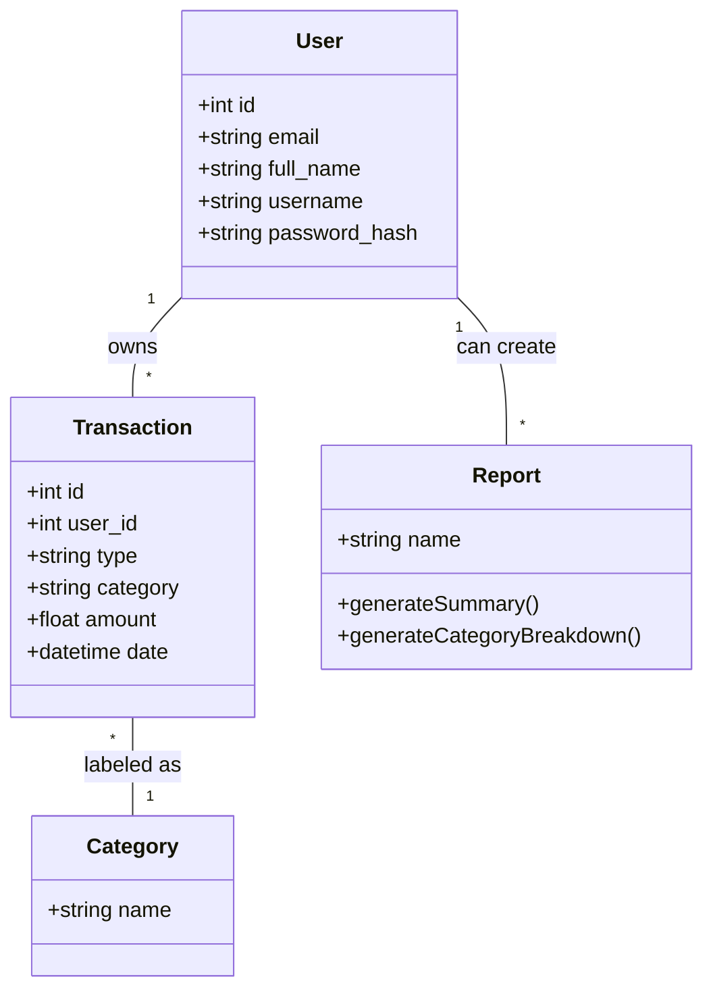

# Class Diagram (Mermaid)

```mermaid
classDiagram
  class User {
    +int id
    +string email
    +string full_name
    +string username
    +string password_hash
  }
  class Transaction {
    +int id
    +int user_id
    +string type
    +string category
    +float amount
    +datetime date
  }
  class Category {
    +string name
  }
  class Report {
    +string name
    +generateSummary()
    +generateCategoryBreakdown()
  }

  User "1" -- "*" Transaction : owns
  Transaction "*" -- "1" Category : labeled as
  User "1" -- "*" Report : can create
```
