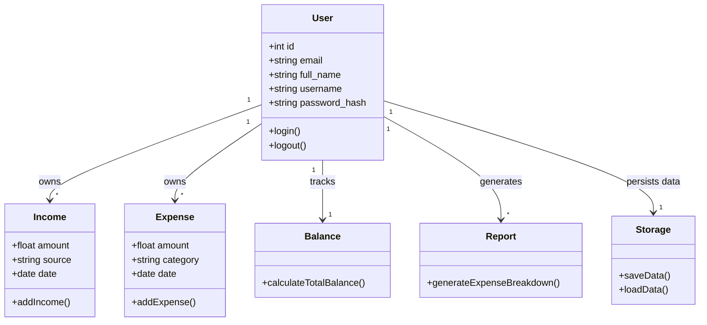

# Class Diagram (Mermaid)

```mermaid
classDiagram
  class User {
    +int id
    +string email
    +string full_name
    +string username
    +string password_hash
    +login()
    +logout()
  }

  class Income {
    +float amount
    +string source
    +date date
    +addIncome()
  }

  class Expense {
    +float amount
    +string category
    +date date
    +addExpense()
  }

  class Balance {
    +calculateTotalBalance()
  }

  class Report {
    +generateExpenseBreakdown()
  }

  class Storage {
    +saveData()
    +loadData()
  }

  User "1" --> "*" Income : owns
  User "1" --> "*" Expense : owns
  User "1" --> "1" Balance : tracks
  User "1" --> "*" Report : generates
  User "1" --> "1" Storage : persists data
```

