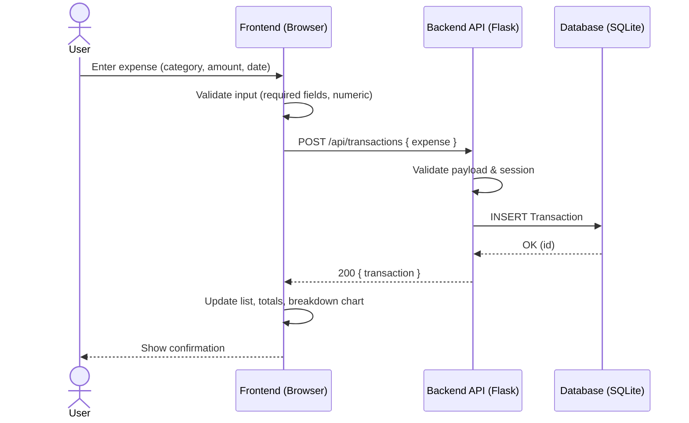

# Sequence Diagram – Add Expense (Mermaid)

```mermaid
sequenceDiagram
  actor U as User
  participant FE as Frontend (Browser)
  participant API as Backend API (Flask)
  participant DB as Database (SQLite)

  U->>FE: Enter expense (category, amount, date)
  FE->>FE: Validate input (required fields, numeric)
  FE->>API: POST /api/transactions { expense }
  API->>API: Validate payload & session
  API->>DB: INSERT Transaction
  DB-->>API: OK (id)
  API-->>FE: 200 { transaction }
  FE->>FE: Update list, totals, breakdown chart
  FE-->>U: Show confirmation
```

