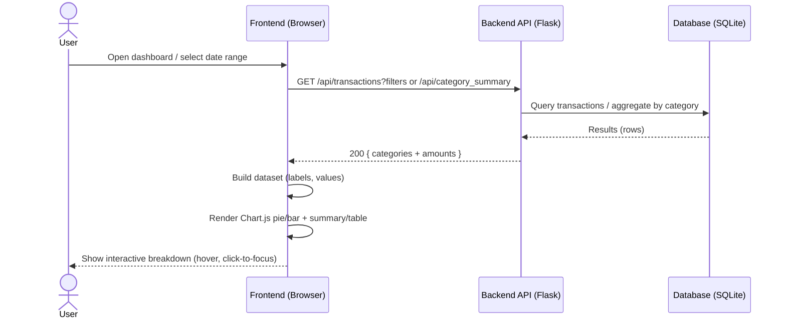

# Sequence Diagram – View Expense Breakdown (Mermaid)

```mermaid
sequenceDiagram
  actor U as User
  participant FE as Frontend (Browser)
  participant API as Backend API (Flask)
  participant DB as Database (SQLite)

  U->>FE: Open dashboard / select date range
  FE->>API: GET /api/transactions?filters or /api/category_summary
  API->>DB: Query transactions / aggregate by category
  DB-->>API: Results (rows)
  API-->>FE: 200 { categories + amounts }
  FE->>FE: Build dataset (labels, values)
  FE->>FE: Render Chart.js pie/bar + summary/table
  FE-->>U: Show interactive breakdown (hover, click-to-focus)
```
