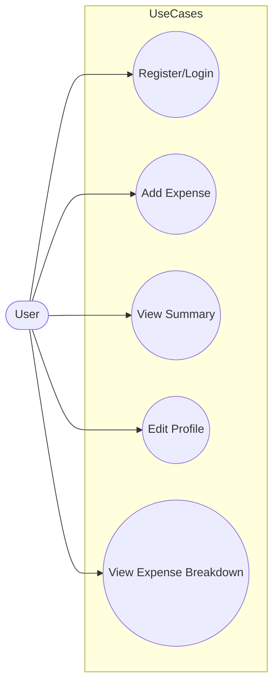

# Use Case Diagram (Mermaid)

```mermaid
flowchart LR
  actorUser([User])

  subgraph UseCases
    UC1((Register/Login))
    UC2((Add Expense))
    UC3((View Summary))
    UC4((Edit Profile))
    UC5((View Expense Breakdown))
  end

  actorUser --> UC1
  actorUser --> UC2
  actorUser --> UC3
  actorUser --> UC4
  actorUser --> UC5
```
