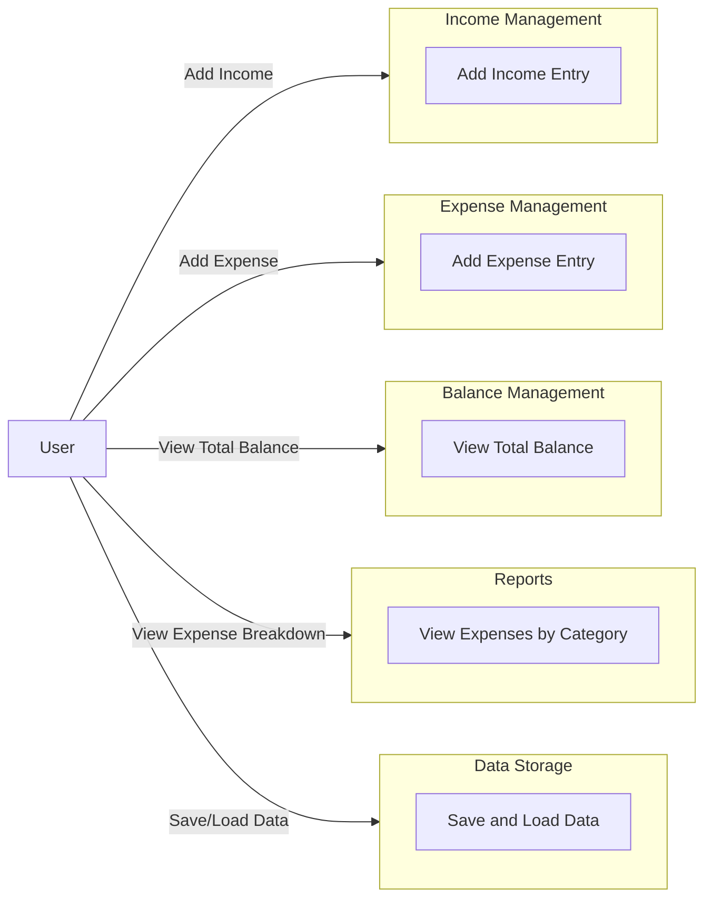

# Use Case Diagram (Mermaid)

```mermaid
flowchart LR
  U[User]

  subgraph A[Income Management]
    A1[Add Income Entry]
  end

  subgraph B[Expense Management]
    B1[Add Expense Entry]
  end

  subgraph C[Balance Management]
    C1[View Total Balance]
  end

  subgraph D[Reports]
    D1[View Expenses by Category]
  end

  subgraph E[Data Storage]
    E1[Save and Load Data]
  end

  U -- Add Income --> A
  U -- Add Expense --> B
  U -- View Total Balance --> C
  U -- View Expense Breakdown --> D
  U -- Save/Load Data --> E
```

<!-- trigger-render: update -->
